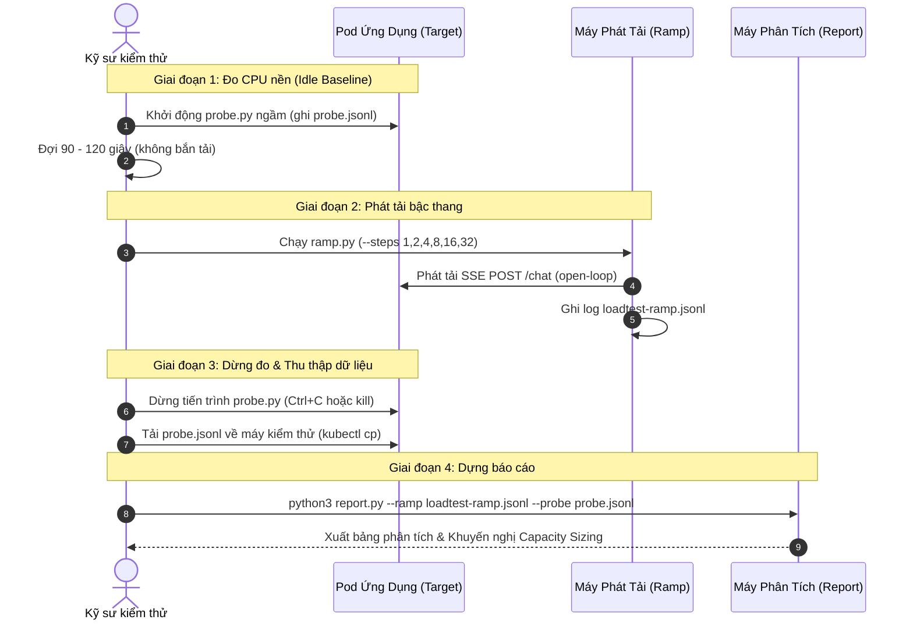

# Capsizer: Bộ công cụ kiểm thử tải & Định chuẩn hiệu năng (Capacity Sizing)

Bộ công cụ chuyên dụng dùng để đo lường, kiểm thử tải và định chuẩn hiệu năng (benchmarking & capacity sizing) cho các dịch vụ Backend / AI Chatbot (FastAPI, Uvicorn, SSE Streaming).

Bộ công cụ giúp trả lời các câu hỏi cốt lõi về mặt kỹ thuật:
1. **Thông lượng tối đa (Max RPS)** mà một Pod / Instance có thể chịu được trước khi gãy là bao nhiêu?
2. **Chi phí CPU cho mỗi request ($C$)** là bao nhiêu mili-giây?
3. **Cấu hình bao nhiêu worker Uvicorn và cấp bao nhiêu CPU core (cgroup quota)** là tối ưu?
4. **Điểm gãy (knee point / saturation point)** xảy ra do đâu: nghẽn CPU (CFS throttling), nghẽn Event Loop hay ứ đọng hàng đợi TCP (accept queue)?

---

## Mục lục
- [1. Kiến trúc & Mô hình chạy (Architecture & Execution Model)](#1-kiến-trúc--mô-hình-chạy-architecture--execution-model)
  - [Mô hình triển khai phân tán](#mô-hình-triển-khai-phân-tán)
  - [Cơ chế phát tải Open-Loop](#cơ-chế-phát-tải-open-loop)
  - [Mô hình định chuẩn năng lực (Capacity Sizing Model)](#mô-hình-định-chuẩn-năng-lực-capacity-sizing-model)
- [2. Các thành phần trong bộ công cụ](#2-các-thành-phần-trong-bộ-công-cụ)
- [3. Yêu cầu môi trường & Cài đặt](#3-yêu-cầu-môi-trường--cài-đặt)
- [4. Hướng dẫn chạy từng bước (Workflow chuẩn)](#4-hướng-dẫn-chạy-từng-bước-workflow-chuẩn)
- [5. Hướng dẫn chi tiết từng công cụ](#5-hướng-dẫn-chi-tiết-từng-công-cụ)
  - [probe.py - Thu thập chỉ số hệ thống](#probepy---thu-thập-chỉ-số-hệ-thống)
  - [ramp.py - Bộ phát tải Open-Loop (Đa kịch bản)](#ramppy---bộ-phát-tải-open-loop-đa-kịch-bản-chat-sse-rest-api-custom-scenario)
  - [report.py - Phân tích dữ liệu & Lập báo cáo](#reportpy---phân-tích-dữ-liệu--lập-báo-cáo)
- [6. Kịch bản thực tế mẫu (End-to-End Walkthrough)](#6-kịch-bản-thực-tế-mẫu-end-to-end-walkthrough)
- [7. Các lưu ý kỹ thuật quan trọng (Best Practices)](#7-các-lưu-ý-kỹ-thuật-quan-trọng-best-practices)
- [8. So sánh ramp.py với Grafana k6](#8-so-sánh-ramppy-với-grafana-k6)

---

## 1. Kiến trúc & Mô hình chạy (Architecture & Execution Model)

### Mô hình triển khai phân tán

Để kết quả đo đạc phản ánh chính xác hiệu năng của dịch vụ mà không bị sai lệch bởi việc tranh chấp tài nguyên, các công cụ được phân bổ theo mô hình sau:

```mermaid
flowchart TD
    subgraph GeneratorHost["MÁY PHÁT TẢI (External Test Runner / VM / Laptop)"]
        Ramp["ramp.py (Open-Loop Load Generator)"]
        UserCSV[("token_pool.csv / UserPool")]
        RampOut[("loadtest-ramp.jsonl")]
        Ramp -->|Đọc User/Token| UserCSV
        Ramp -->|Ghi kết quả request| RampOut
    end

    subgraph K8sNode["KUBERNETES NODE / SERVER MỤC TIÊU"]
        subgraph TargetPod["TARGET POD / CONTAINER"]
            Uvicorn["FastAPI / Uvicorn (App Server)"]
            Probe["probe.py (Daemon lấy mẫu cgroup/TCP)"]
            ProbeOut[("probe.jsonl")]
            
            Probe -->|Ghi snapshot| ProbeOut
            Probe -.->|Theo dõi /health/live| Uvicorn
            Probe -.->|Đọc /proc/net/tcp & /proc/pid| Uvicorn
            Probe -.->|Đọc cpu.stat & cpu.max| CGroup["Linux cgroup (v1/v2)"]
        end
    end

    subgraph Analysis["MÁY PHÂN TÍCH (Analysis & Sizing)"]
        Report["report.py"]
        ReportTable["Bảng phân tích + Capacity Sizing"]
        RampOut -->|Thu thập| Report
        ProbeOut -->|Thu thập| Report
        Report -->|Tổng hợp & Đánh giá| ReportTable
    end

    Ramp ==>|HTTP/1.1 POST /chat (SSE Streaming)| Uvicorn
```

- **Máy phát tải (Generator Host)**: Chạy `ramp.py` từ bên ngoài Pod (máy trạm kỹ sư, VM kiểm thử hoặc Pod loadtest độc lập). **Tuyệt đối không chạy bộ tạo tải bên trong cùng container của ứng dụng** để tránh việc tiến trình phát tải tranh chấp CPU/RAM với ứng dụng mục tiêu.
- **Pod / Container mục tiêu (Target Pod)**: Chạy `probe.py` ngầm (background) trực tiếp trong container của ứng dụng. Nhờ nằm chung Linux namespace và cgroup, `probe.py` có thể đọc trực tiếp các file ảo `/proc/net/tcp`, `/proc/<pid>/*` và `/sys/fs/cgroup` mà không cần cài thêm các công cụ bổ trợ như `ss`, `netstat` hay `iproute2`.
- **Tổng hợp & Báo cáo (Analysis)**: Sau khi đợt kiểm thử kết thúc, cả 2 file `loadtest-ramp.jsonl` và `probe.jsonl` được đưa về để `report.py` đối chiếu theo dòng thời gian.

---

### Cơ chế phát tải Open-Loop

Khác với các công cụ kiểm thử tải truyền thống theo cơ chế **Closed-Loop** (chỉ gửi request mới khi request trước đó đã nhận xong hoặc bị giới hạn bởi số lượng VUs/concurrency cố định), `ramp.py` áp dụng mô hình **Open-Loop**:

```
Closed-Loop (Mô hình truyền thống):
  Client ---> [Gửi Req 1] --------> Server (chậm)
                                       |
  Client <--- [Nhận Resp 1] <----------+ (Sau 5s)
  Client ---> [Gửi Req 2] (Bị chậm theo server => Che giấu hiện tượng sập hàng đợi!)

Open-Loop (Mô hình của ramp.py):
  t = 0.0s:  Client ---> [Gửi Req 1] -------------------> Server
  t = 0.2s:  Client ---> [Gửi Req 2] -------------------> Server
  t = 0.4s:  Client ---> [Gửi Req 3] -------------------> Server
             (Bất kể Server đã xử lý xong hay chưa => Bộc lộ rõ hiện tượng nghẽn hàng đợi!)
```

**Ưu điểm của Open-Loop:**
- Phản ánh đúng hành vi người dùng thực tế: Người dùng không ngừng gửi yêu cầu khi hệ thống chậm lại.
- Làm bộc lộ rõ tình trạng ứ đọng trong hàng đợi hệ điều hành (TCP Accept Queue) và độ trễ nhận mảnh dữ liệu đầu tiên (TTFT - Time To First Token).
- Dễ dàng phát hiện **điểm gãy (knee point)** khi throughput hoàn thành thực tế (`achieved`) sụt giảm so với tốc độ yêu cầu (`offered`).

---

### Mô hình định chuẩn năng lực (Capacity Sizing Model)

Hệ thống tính toán năng lực xử lý dựa trên định luật công suất CPU:

1. **Thời gian CPU thuần cho mỗi request ($C$)**:
   $$\text{Baseline CPU} = \frac{\Delta \text{CPU Usage (khi không tải)}}{\text{Thời gian quan sát (giây)}}$$
   $$C = \frac{\Delta \text{CPU Usage (trong bước tải)} - (\text{Baseline CPU} \times \text{Thời gian bước})}{\text{Số request thành công}} \quad (\text{mili-giây CPU / request})$$

2. **Trần lý thuyết của 1 Worker (1 core CPU)**:
   $$\text{RPS}_{\text{max, 1 worker}} = \frac{1000}{C} \quad (\text{req/s})$$

3. **Trần lý thuyết của Pod được cấp $N$ core CPU quota**:
   $$\text{RPS}_{\text{max, Pod}} = \frac{N \times 1000}{C} \quad (\text{req/s})$$

4. **Số lượng Worker Uvicorn tối ưu**:
   $$\text{Số Worker} \approx \text{CPU Quota Cores} \quad (\text{ví dụ: quota 2.0 cores} \rightarrow 2 \text{ workers})$$

5. **Nhận diện điểm gãy (Knee Detection Criteria)**:
   Một bước kiểm thử bị coi là vượt ngưỡng chịu tải (`KNEE`) nếu vi phạm bất kỳ tiêu chí nào sau:
   - `achieved < 0.90 * offered`: Throughput thực tế đạt dưới 90% mức yêu cầu (ứ đọng hàng đợi).
   - `acceptQ > 0`: Hàng đợi TCP socket lắng nghe có kết nối chờ xử lý mà worker chưa kịp `accept()`.
   - `health_ms (p99) > 1000ms`: Event loop của ứng dụng bị chặn (blocking) khiến endpoint health check phản hồi trên 1 giây.
   - `throttled > 5%`: Tỷ lệ chu kỳ CFS bị bóp nghẽn CPU vượt quá 5%.
   - `abandoned`: Có request bị hủy do vượt quá thời gian dọn dẹp cuối bước (`--settle`).

---

## 2. Các thành phần trong bộ công cụ

Hệ thống được thiết kế theo kiến trúc tách biệt giữa **Runner Engine** (điều phối tải) và **Test Scenarios** (kịch bản kiểm thử API cụ thể):

| Tệp tin / Thư mục | Chức năng chính | Ngôn ngữ / Phụ thuộc | Vị trí thực thi |
| :--- | :--- | :--- | :--- |
| [`probe.py`](file:///home/vbox/projects/capsizer/probe.py) | Thu thập chỉ số hệ thống (cgroup quota, CFS throttling, TCP queue, socket states, worker threads/fds, health latency) | Python 3.10+ (Chỉ dùng thư viện chuẩn) | Bên trong Pod mục tiêu |
| [`ramp.py`](file:///home/vbox/projects/capsizer/ramp.py) | **Core Runner Engine**: Điều phối nhịp phát tải Open-loop theo từng mức RPS, kiểm soát in-flight, stepping, settle và ghi log JSONL | Python 3.10+, `httpx` | Máy phát tải bên ngoài |
| [`scenarios/`](file:///home/vbox/projects/capsizer/scenarios) | **Thư mục kịch bản kiểm thử API (tách riêng khỏi ramp.py)**: | | |
| ├── [`base.py`](file:///home/vbox/projects/capsizer/scenarios/base.py) | Giao diện cơ sở `Scenario` (interface/protocol chuẩn để mở rộng) | Python 3.10+, `httpx` | Module kịch bản |
| ├── [`chat_sse.py`](file:///home/vbox/projects/capsizer/scenarios/chat_sse.py) | **Bài test Chatbot SSE**: Đọc user pool CSV, sinh token HS256, gửi POST /chat, phân tích sự kiện SSE và đo TTFT | Python 3.10+, `httpx`, `pyjwt` | Kịch bản `chat-sse` |
| └── [`rest.py`](file:///home/vbox/projects/capsizer/scenarios/rest.py) | **Bài test REST API**: Kiểm thử mọi endpoint HTTP (GET/POST/PUT/DELETE) với JSON body, đo response latency | Python 3.10+, `httpx` | Kịch bản `rest` |
| [`report.py`](file:///home/vbox/projects/capsizer/report.py) | Phân tích và tương quan log `ramp.jsonl` và `probe.jsonl`, tính toán chỉ số $C$ và lập bảng capacity planning | Python 3.10+ (Chỉ dùng thư viện chuẩn) | Máy phân tích |
| [`pyproject.toml`](file:///home/vbox/projects/capsizer/pyproject.toml) | Cấu hình dự án chuẩn PEP 621 (quản lý dependencies, metadata và lệnh CLI cho `uv` và `pip`) | TOML | Toàn dự án |
| [`requirements.txt`](file:///home/vbox/projects/capsizer/requirements.txt) | Danh sách thư viện phụ thuộc phục vụ người dùng `pip` truyền thống | Plain text | Máy phát tải |

---

## 3. Yêu cầu môi trường & Cài đặt

### Yêu cầu
- Python 3.10 trở lên trên cả máy phát tải và máy chủ đích.
- Hệ điều hành Linux (hỗ trợ cgroup v1 hoặc v2, đọc `/proc`).

### Cài đặt thư viện

1. **Trên máy phát tải (chạy `ramp.py`):**
   - **Cách 1: Sử dụng `uv` (Khuyên dùng - Nhanh nhất ⚡):**
     ```bash
     # Khởi tạo môi trường ảo và cài đặt dependencies tự động (dựa trên pyproject.toml):
     uv sync

     # Chạy trực tiếp qua uv mà không cần kích hoạt venv thủ công:
     uv run ramp.py --help
     ```
   - **Cách 2: Sử dụng `pip` truyền thống:**
     ```bash
     pip install -r requirements.txt
     # Hoặc cài đặt package ở chế độ editable:
     pip install -e .
     ```

2. **Trên Pod / Container mục tiêu (chạy `probe.py`):**
   - **Không cần cài đặt thêm bất kỳ thư viện nào.** `probe.py` chỉ sử dụng thư viện chuẩn của Python (`urllib`, `json`, `os`, `pathlib`, `time`).

3. **Trên máy phân tích (chạy `report.py`):**
   - **Không cần cài đặt thêm thư viện.** `report.py` chỉ dùng thư viện chuẩn (`statistics`, `json`, `pathlib`).

---

## 4. Hướng dẫn chạy từng bước (Workflow chuẩn)

Để có kết quả đo đạc chính xác nhất, quy trình chuẩn gồm 4 bước như sau:



---

## 5. Hướng dẫn chi tiết từng công cụ

### probe.py - Thu thập chỉ số hệ thống

#### Cú pháp dòng lệnh
```bash
python3 probe.py [OPTIONS]
```

#### Bảng tham số
| Tham số | Giá trị mặc định | Giải thích |
| :--- | :--- | :--- |
| `--out` | `/tmp/probe.jsonl` | Đường dẫn file JSONL lưu kết quả lấy mẫu |
| `--interval` | `1.0` | Chu kỳ lấy mẫu dữ liệu (tính bằng giây) |
| `--port` | `8000` | Cổng dịch vụ của ứng dụng (để lọc TCP socket) |
| `--target` | `http://127.0.0.1:8000` | URL gốc của dịch vụ để kiểm tra health check |
| `--health-timeout` | `5.0` | Thời gian timeout khi kiểm tra endpoint `/health/live` (giây) |
| `--no-cgroup` | `False` | Bỏ qua thu thập cgroup/proc (dùng khi chạy từ ngoài Pod, chỉ đo health check) |
| `--once` | `False` | In 1 snapshot metadata và dữ liệu ra màn hình rồi thoát ngay |

#### Ví dụ chạy
- **Chạy thường trực trong container (chế độ chuẩn):**
  ```bash
  python3 probe.py --port 8000 --out /tmp/probe.jsonl
  ```

- **Kiểm tra nhanh thông số cgroup quota và nproc của container:**
  ```bash
  python3 probe.py --once
  ```

---

### ramp.py - Bộ phát tải Open-Loop (Đa kịch bản: Chat SSE, REST API, Custom Scenario)

`ramp.py` được thiết kế theo mẫu **Strategy Pattern**: Core Open-Loop Engine độc lập với logic request, cho phép kiểm thử bất kỳ API nào thông qua việc lựa chọn kịch bản:
1. `chat-sse` (mặc định): Đo endpoint Chatbot streaming SSE (`POST /chat`), đo TTFT.
2. `rest`: Đo mọi API REST tiêu chuẩn (GET, POST, PUT, DELETE,...), đo latency.
3. Custom Scenario: Tải class kế thừa từ `Scenario` từ một file Python độc lập thông qua `--scenario-file`.

#### Cú pháp dòng lệnh
```bash
# Cách 1: Sử dụng uv (Khuyên dùng - tự động quản lý môi trường ảo):
uv run ramp.py [OPTIONS]

# Cách 2: Sử dụng python3 thông thường (sau khi đã cài đặt dependencies):
python3 ramp.py [OPTIONS]
```

#### Bảng tham số
| Tham số | Giá trị mặc định | Giải thích |
| :--- | :--- | :--- |
| `--scenario` | `chat-sse` | Kịch bản kiểm thử: `chat-sse` (mặc định) hoặc `rest` |
| `--scenario-file` | `""` | File Python chứa custom Scenario class (kế thừa từ `Scenario`) |
| `--method` | `GET` | HTTP method cho kịch bản REST (`GET`, `POST`, `PUT`, `DELETE`,...) |
| `-H`, `--header` | `None` | Thêm HTTP header tùy chọn (ví dụ: `-H 'Authorization: Bearer xxx' -H 'X-Api-Key: 123'`) |
| `--body` | `""` | Chuỗi body gửi kèm cho request REST (chuỗi JSON hoặc chuỗi text thô) |
| `--body-file` | `""` | Đường dẫn file chứa dữ liệu body cho request REST |
| `--url` | `http://127.0.0.1:8000/chat` | URL endpoint nhận request |
| `--steps` | `1,2,4,8,16,32` | Danh sách các mức RPS cần đo, phân tách bằng dấu phẩy |
| `--step-seconds` | `60.0` | Thời gian phát tải ở mỗi mức RPS (giây) |
| `--cooldown` | `20.0` | Thời gian nghỉ giải tỏa tải giữa 2 bậc RPS (giây) |
| `--settle` | `60.0` | Thời gian chờ tối đa cho các request còn dở dang ở cuối mỗi bậc |
| `--timeout` | `120.0` | Read timeout cho mỗi request (giây) |
| `--max-inflight` | `2000` | Trần kết nối đồng thời tối đa của máy phát tải (bảo vệ máy phát tải) |
| `--users-csv` | `users.csv` | Đường dẫn file CSV chứa danh sách user (cột `token` hoặc `user_token`) |
| `--user-token` | `loadtest-token` | Token dùng chung khi không sử dụng file CSV (cho kịch bản `chat-sse`) |
| `--jwt` | `""` | JWT token có sẵn gửi trong header `Authorization: Bearer <token>` |
| `--jwt-secret` | `$JWT_SECRET` | Secret ký HS256 JWT nếu chưa có sẵn token (quyền `super_admin`) |
| `--queries` | `""` | File chứa danh sách câu hỏi kiểm thử cho chatbot (mỗi dòng một câu) |
| `--insecure` | `False` | Bỏ qua kiểm tra chứng chỉ TLS (khi qua Ingress cert tự ký) |
| `--cache-bust` | `False` | Thêm mã ngẫu nhiên vào câu hỏi để tránh cache |
| `--stop-on-knee` | `False` | Tự động ngắt kịch bản khi `achieved < 90% offered` |
| `--out` | `loadtest-ramp.jsonl` | File JSONL xuất kết quả kiểm thử tải |

#### Ví dụ chạy thực tế

- **Ví dụ 1: Test API Chatbot streaming SSE (Kịch bản mặc định):**
  ```bash
  export JWT_SECRET="your-jwt-secret-key"
  python3 ramp.py \
    --scenario chat-sse \
    --url "https://api.example.com/chat" \
    --users-csv users.csv \
    --steps "2,4,8,12,16" \
    --step-seconds 60 \
    --cooldown 20 \
    --stop-on-knee \
    --insecure \
    --out loadtest-ramp.jsonl
  ```

- **Ví dụ 2: Test API REST GET thông thường (ví dụ: lấy danh sách items):**
  ```bash
  python3 ramp.py \
    --scenario rest \
    --method GET \
    --url "http://127.0.0.1:8000/api/v1/items" \
    -H "Authorization: Bearer my-token" \
    --steps "10,20,50,100" \
    --step-seconds 30 \
    --out loadtest-items.jsonl
  ```

- **Ví dụ 3: Test API REST POST với JSON Body (ví dụ: tìm kiếm search/embedding):**
  ```bash
  python3 ramp.py \
    --scenario rest \
    --method POST \
    --url "http://127.0.0.1:8000/api/v1/search" \
    -H "Content-Type: application/json" \
    -H "X-Api-Key: secret123" \
    --body '{"query": "an ninh mạng", "limit": 10}' \
    --steps "5,10,20,40" \
    --step-seconds 30 \
    --out loadtest-search.jsonl
  ```

- **Ví dụ 4: Viết và chạy Custom Scenario bằng file Python riêng:**
  Tạo file `custom_scenario.py`:
  ```python
  from ramp import Scenario
  import time

  class CustomUserScenario(Scenario):
      name = "user-profile"
      metric_label = "lat"

      async def execute(self, client):
          t0 = time.perf_counter()
          resp = await client.get("http://127.0.0.1:8000/api/v1/me", headers={"X-User-Id": "123"})
          dur = (time.perf_counter() - t0) * 1000
          return {
              "type": "req",
              "t_start": time.time(),
              "ok": resp.status_code == 200,
              "status": resp.status_code,
              "total_ms": dur,
              "ttft_ms": dur,
              "err": None if resp.status_code == 200 else f"http_{resp.status_code}"
          }
  ```
  Thực thi:
  ```bash
  python3 ramp.py --scenario-file custom_scenario.py --steps "5,10,20" --out loadtest-custom.jsonl
  ```

#### Cách thêm một kịch bản kiểm thử (Scenario) mới

Bạn có thể dễ dàng mở rộng để kiểm thử bất kỳ dịch vụ hay API nào theo 2 cách:

##### Cách 1: Thêm trực tiếp vào thư mục `scenarios/` (Khuyên dùng cho kịch bản dùng chung của dự án)
1. Tạo file mới `scenarios/my_service.py` kế thừa từ `Scenario` (trong `scenarios/base.py`):
   ```python
   import time
   import httpx
   from .base import Scenario

   class MyServiceScenario(Scenario):
       name = "my-service"
       metric_label = "lat"  # Hiển thị trên bảng kết quả: lat_p50, lat_p95

       async def execute(self, client: httpx.AsyncClient):
           t0 = time.perf_counter()
           resp = await client.get("http://127.0.0.1:8000/api/v1/data")
           dur = (time.perf_counter() - t0) * 1000
           return {
               "type": "req",
               "t_start": time.time(),
               "ok": resp.status_code == 200,
               "status": resp.status_code,
               "total_ms": dur,
               "ttft_ms": dur,
               "err": None if resp.status_code == 200 else f"http_{resp.status_code}",
           }
   ```
2. Đăng ký kịch bản vào `REGISTRY` trong `scenarios/__init__.py`:
   ```python
   from .my_service import MyServiceScenario
   REGISTRY["my-service"] = MyServiceScenario
   ```
3. Chạy qua dòng lệnh:
   ```bash
   python3 ramp.py --scenario my-service --steps 10,20,50
   ```

##### Cách 2: Nạp file kịch bản độc lập từ bên ngoài (Khuyên dùng cho kịch bản tạm thời hoặc ad-hoc)
Tạo file Python ở bất kỳ thư mục nào (ví dụ `my_custom.py`) kế thừa từ `Scenario`, sau đó chạy:
```bash
python3 ramp.py --scenario-file ./my_custom.py --steps 5,10,20
```

---

### report.py - Phân tích dữ liệu & Lập báo cáo

#### Cú pháp dòng lệnh
```bash
python3 report.py --ramp <file-ramp.jsonl> [--probe <file-probe.jsonl>]
```

#### Bảng tham số
| Tham số | Bắt buộc | Giải thích |
| :--- | :--- | :--- |
| `--ramp` | **Có** | File JSONL chứa kết quả phát tải từ `ramp.py` |
| `--probe` | Không | File JSONL chứa chỉ số hệ thống từ `probe.py` |

#### Giải thích các cột trong bảng kết quả của `report.py`
```text
 offer  achiev    ok  err  ttftP50  ttftP95  cores    C_ms   thr%  acptQ  hlthP99  estab  fdMax  thrd  verdict
------------------------------------------------------------------------------------------------------------
   2.0    2.00   120    0      230      450   0.45   180.2    0.0      0       12     18     42    16  OK
   4.0    3.98   239    1      310      620   0.88   185.1    1.2      0       15     34     45    16  OK
   8.0    6.50   390   90     2100     5400   1.98   190.5   18.5      4     1250     75     52    18  KNEE: achieved<offered, acceptQ>0, throttled
```

- `offer`: Mức RPS mục tiêu phát ra từ bộ tạo tải.
- `achiev`: Throughput thực tế hoàn thành thành công (`req/s`).
- `ok` / `err`: Số lượng request thành công / thất bại trong bậc kiểm thử.
- `ttftP50` / `ttftP95`: Độ trễ nhận token/nội dung đầu tiên ở phân vị p50 và p95 (ms).
- `cores`: Số lượng CPU core thực tế container đã tiêu thụ.
- `C_ms`: Thời gian CPU tiêu thụ trung bình cho mỗi request (đã trừ CPU nền).
- `thr%`: Tỷ lệ phần trăm chu kỳ CFS bị bóp nghẽn CPU (`nr_throttled / nr_periods`).
- `acptQ`: Số kết nối lớn nhất bị dồn ứ trong TCP Accept Queue.
- `hlthP99`: Độ trễ endpoint `/health/live` ở phân vị p99 (đo mức độ nghẽn event loop).
- `estab`: Số lượng kết nối TCP ở trạng thái `ESTABLISHED`.
- `fdMax`: Số file descriptor lớn nhất của một tiến trình worker.
- `thrd`: Số OS thread lớn nhất trong một tiến trình worker.
- `verdict`: Trạng thái đánh giá (`OK` hoặc `KNEE` kèm nguyên nhân cụ thể).

---

## 6. Kịch bản thực tế mẫu (End-to-End Walkthrough)

Dưới đây là kịch bản đo kiểm thực tế một Pod FastAPI/Uvicorn trên cụm Kubernetes:

### Bước 1: Khởi động probe trên Pod và lấy CPU nền
Mở terminal 1, kết nối vào Pod và chạy `probe.py`:
```bash
# Đặt biến môi trường Pod
POD_NAME="app-deployment-78b958c97-xyz12"
NAMESPACE="default"

# Copy probe.py vào pod nếu chưa có sẵn
kubectl cp probe.py ${NAMESPACE}/${POD_NAME}:/tmp/probe.py

# Khởi chạy probe ngầm trong pod
kubectl exec -n ${NAMESPACE} ${POD_NAME} -- \
  python3 /tmp/probe.py --port 8000 --out /tmp/probe.jsonl
```
> [!IMPORTANT]
> **Chờ tối thiểu 90 - 120 giây** trước khi chuyển sang bước 2. Điều này giúp `probe.py` đo được chính xác mức tiêu thụ CPU nền khi ứng dụng ở trạng thái nghỉ (idle baseline), tránh ảnh hưởng của các tác vụ nền định kỳ.

### Bước 2: Khởi chạy bộ tạo tải `ramp.py`
Mở terminal 2 (trên máy phát tải bên ngoài), thực thi lệnh:
```bash
export JWT_SECRET="your-secret-key"

# Chạy với uv (hoặc thay 'uv run' bằng 'python3'):
uv run ramp.py \
  --url "https://api.example.com/chat" \
  --users-csv users.csv \
  --steps "1,2,4,8,12,16" \
  --step-seconds 60 \
  --cooldown 20 \
  --settle 60 \
  --insecure \
  --stop-on-knee \
  --out /tmp/loadtest-ramp.jsonl
```

Quan sát terminal để theo dõi bảng tiến độ theo từng bậc RPS:
```text
 offered  achieved     ok   err  drop  ttft_p50  ttft_p95  inflight
-----------------------------------------------------------------
     1.0      1.00     60     0     0       185       320         2
     2.0      2.00    120     0     0       210       390         4
     4.0      4.00    240     0     0       295       580         9
...
```

### Bước 3: Thu thập file `probe.jsonl` từ Pod về máy phân tích
Sau khi `ramp.py` hoàn thành:
1. Nhấn `Ctrl+C` ở terminal 1 để dừng `probe.py`.
2. Tải file log từ Pod về:
   ```bash
   kubectl cp ${NAMESPACE}/${POD_NAME}:/tmp/probe.jsonl /tmp/probe.jsonl
   ```

### Bước 4: Dựng báo cáo và đọc kết quả
Chạy lệnh phân tích:
```bash
python3 report.py --ramp /tmp/loadtest-ramp.jsonl --probe /tmp/probe.jsonl
```

**Mẫu kết luận xuất ra từ `report.py`:**
```text
====================================================================================================
CALIBRATE - KẾT QUẢ
====================================================================================================
cpu_quota_cores : 2.0
nproc nhìn thấy : 64 (core của NODE, không phải quota)
executor threads: 32 / worker
CPU nền (không tải)    : 0.082 core (115 mẫu / 115s)

[... Bảng chi tiết từng bậc ...]

KẾT LUẬN
  C (trung vị các bậc còn khoẻ)   : 175.4 ms CPU / request
  Trần lý thuyết 1 worker (1 core) : 5.7 req/s
  Trần lý thuyết pod (2 core)      : 11.4 req/s
  Số worker hợp lý                 : 2 (= quota)
  Điểm gãy quan sát được           : 8 req/s offered
  Bậc cuối còn khoẻ                : 4 req/s -> SLO
```

---

## 7. Các lưu ý kỹ thuật quan trọng (Best Practices)

### 1. Hiện tượng "Phình Thread Pool" (`nproc_visible` vs `cpu_quota_cores`)
Trong Kubernetes, `os.cpu_count()` thường trả về số core của máy chủ vật lý (Node, ví dụ 64 core), chứ không phải mức giới hạn CPU Quota của Pod (ví dụ 2 core).
- Nhiều thư viện Python và `asyncio` mặc định khởi tạo ThreadPoolExecutor dựa trên `os.cpu_count()`.
- Việc sinh ra quá nhiều thread trên một Pod có quota thấp sẽ dẫn đến tranh chấp CPU gay gắt, gây ra hiện tượng **CFS Throttling nặng** dù ứng dụng chưa đầy tải.
- `probe.py` và `report.py` sẽ cảnh báo trực tiếp nếu phát hiện `nproc_visible > quota * 2`.

### 2. Tắt Semantic Cache khi kiểm thử
Để đo chính xác năng lực tính toán và xử lý của mô hình/dịch vụ, cần đảm bảo tính năng Semantic Cache đã được tắt (hoặc thêm cờ `--cache-bust` nếu chạy bản cũ). Nếu cache bật, các request trùng lặp sẽ trả về ngay lập tức, dẫn đến chỉ số $C$ đo được bị sai lệch so với thực tế.

### 3. Kích thước User Pool (Tránh Rate-Limit tài khoản)
Nếu số lượng tài khoản trong file CSV quá ít, một tài khoản sẽ bị tái sử dụng liên tục trong thời gian ngắn:
$$\text{reuse\_interval} = \frac{\text{Tổng số User trong Pool}}{\text{RPS}}$$
Nếu `reuse_interval < 120s`, request có nguy cơ bị chặn bởi tầng rate-limit cấp tài khoản thay vì phản ánh giới hạn của hệ thống. Hãy chuẩn bị file CSV có ít nhất `200 - 500` tài khoản cho các bài test tải lớn.

### 4. Thời gian lấy mẫu Baseline tối thiểu 90s
Các ứng dụng thường có các cron job nội bộ chạy ngầm (ví dụ: đồng bộ cấu hình, cache nền theo chu kỳ 30 - 45s). Nếu đo baseline quá ngắn (< 90s), giá trị CPU nền sẽ bị dao động mạnh, dẫn đến việc tính toán chỉ số $C$ bị thiếu chính xác.

---

## 8. So sánh ramp.py với Grafana k6

### Bài test trong ramp.py có gì đặc biệt?
`ramp.py` không đơn thuần là một công cụ phát request thông thường, mà được thiết kế chuyên biệt cho bài toán **Định chuẩn năng lực (Capacity Sizing & Tuning)** của các dịch vụ AI / Streaming:

1. **Cơ chế Open-Loop đo chính xác sự ứ đọng hàng đợi:**
   - Các bài test truyền thống thường theo cơ chế *Closed-Loop* (giữ số user/concurrency cố định, chờ response xong mới gửi tiếp). Khi server chậm, client tự chậm theo $\rightarrow$ **che giấu việc nghẽn hàng đợi**.
   - `ramp.py` bắn tải độc lập theo lịch trình tuyệt đối ($1/\text{RPS}$). Khi server bắt đầu quá tải, request vẫn được phát đều đặn $\rightarrow$ bộc lộ rõ sự tích tụ trong TCP Accept Queue và sự sụt giảm của throughput thực tế (`achieved < offered`).

2. **Bóc tách sâu luồng Streaming SSE (Server-Sent Events) của AI:**
   - Các API AI Chatbot trả về dữ liệu dạng streaming từng token.
   - `ramp.py` phân tích từng dòng sự kiện SSE theo thời gian thực:
     - **TTFT (Time To First Token):** Thời điểm nhận `event: message` đầu tiên chứa nội dung trả lời (chỉ số quan trọng nhất với trải nghiệm người dùng AI).
     - **Notice Latency:** Thời điểm nhận `event: notice` khi AI Agent bắt đầu gọi Tool / Function Calling.
     - **End-of-Stream:** Bắt buộc nhận được `event: message_end` để xác nhận request hoàn thành trọn vẹn, không bị đứt kết nối giữa chừng do proxy/timeout.

3. **Cơ chế Cooldown & Settle giữa các bậc tải:**
   - Sau mỗi bậc RPS, `ramp.py` có giai đoạn **drain/settle** (`--settle`) để chờ các request dở dang hoàn tất, và giai đoạn **cooldown** (`--cooldown`) để server xả hết CPU, thu dọn rác (GC) và giải phóng event loop, đưa tài nguyên về mức nền (baseline) trước khi bước vào bậc tải tiếp theo.

4. **Tự động ngắt khi chạm điểm gãy (`--stop-on-knee`):**
   - Khi throughput hoàn thành thực tế tụt xuống dưới 90% mức yêu cầu (`achieved < 0.90 * offered`), kịch bản tự động ngắt sớm để bảo vệ cụm máy chủ và không lãng phí thời gian đo các bậc cao hơn khi hệ thống đã bão hòa.

5. **Đồng bộ thời gian thực 100% với `probe.py` và `report.py`:**
   - Mỗi request được gắn dấu thời gian epoch chính xác (`t_start`, `t_step_start`, `t_step_end`). Nhờ đó, `report.py` có thể đối chiếu khớp từng mili-giây với dữ liệu cgroup kernel (`probe.jsonl`) để tính toán **chỉ số $C$ (ms CPU / request)**, trần lý thuyết của Pod và số lượng worker tối ưu.

---

### Dùng k6 thì có được không? Có tạo ra bài test giống hệt không?

> **Trả lời:** **Có thể dùng k6**, nhưng **không thể tạo ra bài test giống hệt 100%** nếu không viết thêm script tùy biến phức tạp và adapter parse log.

Thực tế, cả k6 và `ramp.py` đều có thể tái sử dụng chung file CSV danh sách người dùng (`users.csv`). Dưới đây là phân tích chi tiết:

#### Những điểm k6 làm được:
- **Cơ chế Open-loop:** k6 hỗ trợ rất tốt qua executor `constant-arrival-rate` hoặc `ramping-arrival-rate`.
- **Hiệu năng phát tải:** k6 viết bằng Go nên có thể sinh tải hàng chục nghìn RPS từ 1 máy (vượt trội hơn Python nếu cần stress test quy mô lớn).
- **User Pool xoay vòng:** k6 dùng `SharedArray` hoặc `papaparse` để luân phiên token từ CSV.

#### Những điểm k6 gặp khó khăn hoặc khác biệt so với `ramp.py`:
1. **Hỗ trợ SSE Streaming & đo TTFT:**
   - Mặc định `http.post()` của k6 đợi tải toàn bộ response body về bộ nhớ rồi mới trả kết quả $\rightarrow$ **không đo được TTFT** một cách tự nhiên.
   - Để đo TTFT trên k6, cần dùng extension thử nghiệm (`xk6-sse`) hoặc xử lý raw chunks, viết mã JavaScript phức tạp và khó bắt chính xác cấu trúc `event: message_end`.
2. **Khoảng nghỉ Cooldown giữa các bậc độc lập:**
   - Trong k6, các bậc tải thường chạy liên tục hoặc chuyển tiếp tuyến tính. Để tạo khoảng nghỉ hoàn toàn (ví dụ 20s) giữa các bậc để server hồi phục CPU nền, bạn phải cấu hình nhiều scenario nối tiếp nhau với `startTime` tính toán thủ công.
3. **Điều kiện dừng động `--stop-on-knee`:**
   - k6 có `thresholds` (ngắt khi error rate > 5%, p95 > 2s), nhưng không có sẵn threshold so sánh tỷ lệ thông lượng hoàn thành thực tế so với mục tiêu (`achieved < 90% offered`) để tự động ngắt tải khi qua điểm gãy.
4. **Không tương thích trực tiếp với `report.py` ($C$-Model):**
   - Đây là lý do cốt lõi bộ công cụ này ra đời: Định dạng log JSONL của `ramp.py` khớp chuẩn với `report.py` để tương quan trực tiếp với dữ liệu cgroup từ `probe.py`.
   - Nếu dùng k6, bạn phải viết thêm adapter trích xuất metrics từ k6 để ghép nối với `probe.jsonl`.

---

### Bảng so sánh tổng hợp (ramp.py vs Grafana k6)

| Tiêu chí | `ramp.py` (Python) | Grafana `k6` |
| :--- | :--- | :--- |
| **Mục đích chính** | **Capacity Sizing & Tuning** (Định chuẩn năng lực, tìm điểm gãy CPU & sizing Pod/Worker) | **Load & Stress Testing** (Kiểm thử tải diện rộng cho toàn hệ thống) |
| **Xử lý SSE Streaming & TTFT** | **Tự nhiên & chính xác** (đo TTFT, notice time, message_end) | Khó hơn nhiều (phải dùng module SSE thử nghiệm hoặc xử lý raw chunks) |
| **Pacing Open-Loop** | Có sẵn (tính theo timestamp tuyệt đối $1/\text{RPS}$) | Có sẵn (`constant-arrival-rate`) |
| **Cooldown giữa các bậc tải** | Có sẵn (`--cooldown` để giải phóng CPU/GC) | Phải cấu hình thủ công nhiều scenario |
| **Tự ngắt khi vượt điểm gãy** | Có sẵn (`--stop-on-knee` khi achieved < 90%) | Phải viết custom threshold phức tạp |
| **Năng lực phát tải tối đa** | Phù hợp cấp Pod / Instance (vài nghìn RPS) | **Cực lớn** (hàng chục nghìn RPS nhờ runtime Go) |
| **Tích hợp với `report.py` ($C$-Model)** | **Tương thích 100%** | Cần viết thêm adapter chuyển đổi log |

---

### Khi nào nên dùng công cụ nào?

- **Nên dùng `ramp.py` khi:**
  - Bạn cần **tinh chỉnh (tune) cấu hình cho Pod/Service**: tìm ra giới hạn của 1 Pod, đo chi phí CPU cho mỗi request ($C$), xác định xem nên đặt CPU quota là bao nhiêu core, chạy bao nhiêu worker Uvicorn là tối ưu.
  - Bạn cần đo đạc chính xác **độ trễ nhận token đầu tiên (TTFT)** của mô hình AI Chatbot hỗ trợ streaming SSE.
  - Cần bộ công cụ gọn nhẹ, chạy ngay không cần cài đặt thêm runtime Go hay k6 binary.

- **Nên dùng `k6` khi:**
  - Bạn muốn bắn tải ở mức độ **toàn hệ thống (End-to-End Stress Test)** với hàng chục nghìn user đồng thời qua API Gateway / Ingress.
  - Cần kiểm tra độ ổn định kéo dài nhiều giờ (Soak test), kiểm tra khả năng tự động co giãn (HPA) của toàn cụm Kubernetes hoặc test các kịch bản hành vi người dùng phức tạp (Multi-page browsing).

